# Portfolio_Analysis

The goal of this analysis is to determine which portfolio out of a group is performing the best across multiple areas: volatility, returns, risk, and Sharpe ratios. The different portfolios represent those of "whale" investors, hedge and mutual funds, and algorithmic traders. To complete this, a tool was created in Python to analyze and visualizesthe major metrics of the portfolios across all of these areas, and determine which portfolio outperformed the others. Historical daily returns of each of the portfolios were used as part of the analysis. Once the analysis was compelted, a custom portfolio of stocks was created to compare its performance to that of the other portfolios, as well as the larger market (S&P 500 Index).

The analsyis was performed in the following steps:

1. Clean data sets of returns data for portfolios of mulitple whale investors and algorithms over a set time period.
2. Compute returns for the S&P 500 over the same time period.
3. Perform statistical analysis of the returns of the portfolios and the S&P 500, and determine how whether the alogorithmic portfolios outcompete the rest.
4. Create a custom portfolio of 3 stocks to determine if they outperform the all of the portfolios and the S&P 500.Analysis of existing investors' portfolios, algorithm trading portfolios, and a custom portfolio.

---

## Results for Comparison of Portfolios

The following visualizations and tables were created to analyze and compare the portfolios.

The cumulative returns show which portfolios outperformed the others based only on returns.
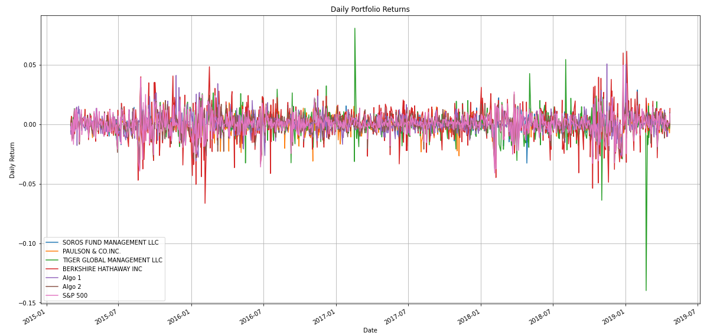

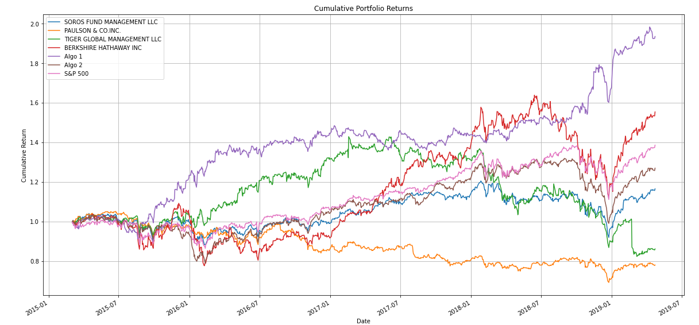

Annualized standard deviations were calculated for each portfolio and presented in the table below. The rolling-21 day average standard deviation was also analyzed for each portfolio for more resolution in the analysis.

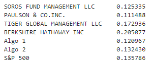

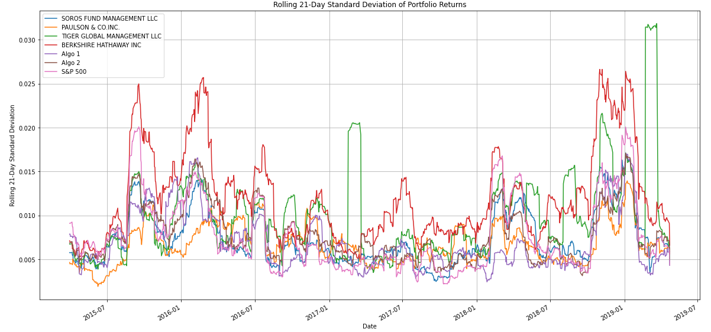

Annualized Sharpe ratios were then calculated and are presented in both tabular and graphical form below. The Sharpe ratio represents the ratio of return-to-risk.

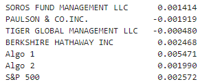

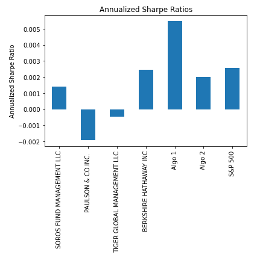

## Conclusions for Comparison of Portfolios

In terms of returns, Algorithm 1 performed the best and Algorithm 2 performed fourth best.

Based on the standard deviation calucations, both of the Algorithm portfolios were shown to be less risky than the S&P 500, but they're more risky than the Soros Fund Management and Paulson & Co. "whale" portfolios. The Tiger Global Management and Berkshire Hathaway portfolios were both determined to be riskier than the S&P 500.

However, risk alone can't determine performance, so the Sharpe Ratios were considered to compare both returns and risk. Algorithm 1 has the highest Sharpe Ratio of all portfolios and the S&P 500, so it generated the highest returns (i.e, outperformed all others) on a risk-adjusted basis. Algorithm 2 had a Sharpe Ratio less than that of the S&P 500 and Berkshire Hathaway. Therefore, Algorithm 2 only outperformed Soros Fund Management, Paulson & Co., and Tiger Global Management on a risk-adjusted basis.

Based on all these factors, Algorithm 1 was determined to be the best performing portfolio. 

---

## Results for Custom Portfolio
The stocks chosen for the custom portfolio were Disney (DIS), Amazon (AMZN), and Microsoft (MSFT). The following visualizations and tables were created to analyze and compare the portfolios.

The annualized standard deviation of the custom portfolio was calculated and compared to that for each portfolio. The comparison table is presented below. The rolling-21 day average standard deviation was also analyzed for the custom portfolio and plotted against that of the other portfolios, as shown below.

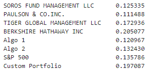

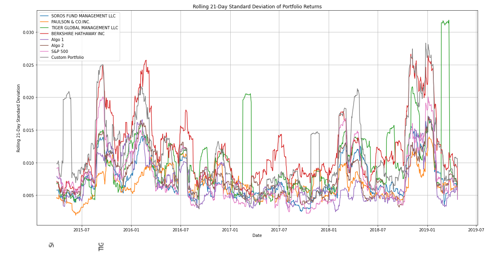

The same was done to compare the annualized Sharpe ratios for the custom portfolio with that of the other portfolios, as shown below.

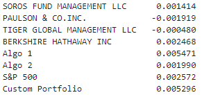

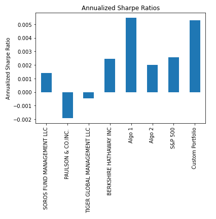

The 60-day rolling beta was also calculated for the custom portfolio to evaluate risk in another form compared to the S&P 500. The plot of the rolling beta is shown below.

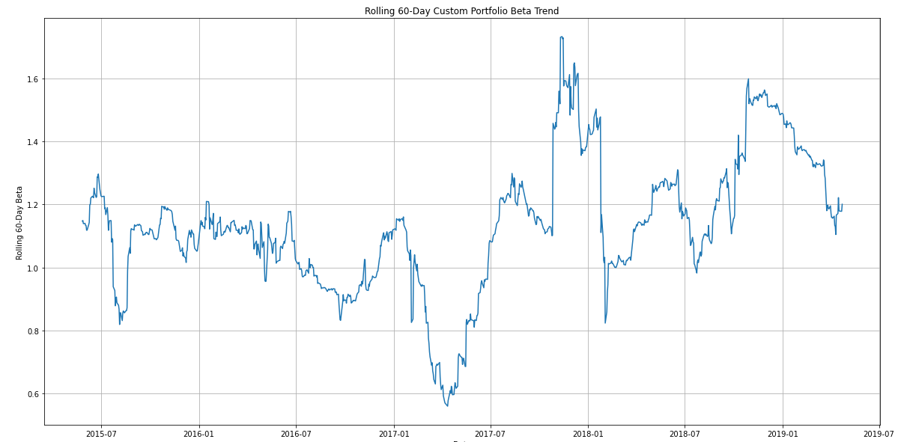

## Conclusions for Custom Portfolio

Per the standard deviation calculations, the custom portfolio is riskier than the S&P 500 and all other portfolios except for only Berkshire Hathaway. The plot of the 60-day rolling beta for the custom portfolio reinforces that it is risky/more volatile as compared to the S&P 500 since its beta is greater than 1 for a majority of the time range of the data set. 

However, when taking into account the portfolio returns with this risk (i.e, the Sharpe Ratio), the custom portfolio shows the second highest Sharpe Ratio behind only Algorithm 1. Therefore, for the specified timeframe of the dataset, the custom portfolio generated higher returns on a risk-adjusted basis than all of the whale investors, the S&P 500, and Algorithm 2!

